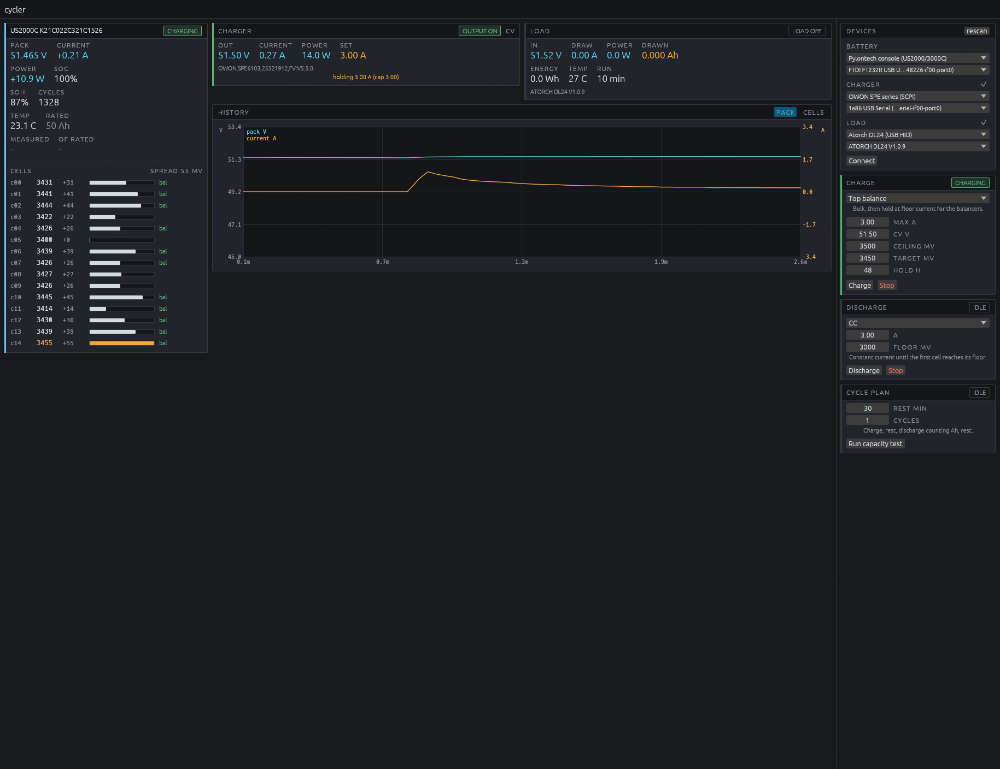

# cycler

Battery cycle testing driven by the cells rather than by pack voltage. It charges, rests, discharges and counts amp-hours, and every
decision it makes (taper, float, cut off) is made on the highest or lowest
cell, because a pack with one weak cell is only as good as that cell.

Built for a Pylontech US2000C on the bench with an OWON bench supply and a
programmable load, but the devices are behind traits: a pack is anything that
reports cell voltages, a charger is anything that can be set and switched, and
a load is anything that can sink current (or a resistor bank you switch by
hand).



## What it does

- **Charge** in four modes: automatic bulk-then-float to full, plain bulk with
  a current taper, top balance (hold at the top so passive balancers can work),
  or unbalanced (stop the instant any cell touches the ceiling).
- **Discharge** in CC, CV, CR or CP, stopping on the first cell to reach its
  floor rather than waiting for the BMS to trip.
- **Stop at a state of charge** in either direction, for putting a pack into
  storage at 50% rather than leaving it full or flat.
- **Cycle plans**: charge, rest, discharge counting amp-hours, rest, repeated,
  producing the measured capacity against the pack's nameplate rating.
- **Charge a pack with no BMS** (lead-acid, a bare pack) on voltage limits
  alone, using the charger as the voltmeter.
- **Show the BMS's own alarms**, so a protection state is visible rather than
  inferred from the numbers.
- **Log** every sample to CSV: pack, current, SOC, SOH, cycles, temperature,
  per-cell millivolts, balancing flags, alarms, charger setpoint and load totals.
- **Watch** it live in a GUI, or run it from the CLI.

## Hardware support

| Role | Backend | Notes |
|---|---|---|
| Pack (serial) | `pylontech-console`, `pylontech-rs485`, `seplos`, `pace`, `daly`, `jk`, `jbd` | Any [battery-control](https://github.com/v0l/battery-control) backend that reports cells. Baud and RS485 address default per protocol; override with `BMS_BAUD` and `BMS_ADDRESS`. |
| Pack (none) | `none` | No BMS at all: lead-acid, or a bare pack on a plain charger. Voltage and current come from whichever instrument is connected, and every limit becomes a pack-voltage limit. |
| Pack (Bluetooth) | `jk-ble`, `jbd-ble`, `sok`, `renogy` | Found by scanning; the target is the BLE address. Scan length is `BLE_SCAN_SECS` (default 6). |
| Charger | `owon` | OWON SPE/SP/SPS series over SCPI. |
| Load | `dl24` | Atorch DL24 over USB HID. Watch the voltage rating: the family shares one USB id across very different models. |
| Load | `oel` | OWON OEL15/30/60 series over SCPI, including the instrument's own battery test mode. **Untested against hardware.** |
| Load | `passive` | Anything dumb: a resistor bank, bulbs, an inverter. Current comes from the pack's shunt through the BMS. |

Devices are found at runtime, never hardcoded:

```
cycler devices
```

## Usage

```bash
# What is plugged in
cycler devices

# Charge to full and stop, logging every sample
cycler charge --mode auto --max-current 3 --log run.csv

# Top balance: hold at the top for up to 48 h so the balancers can work
cycler charge --mode top-balance --target-mv 3450 --hold-hours 48

# Discharge at 3 A until the first cell reaches 3.0 V
cycler discharge --setpoint 3 --floor-mv 3000

# Lead-acid, no BMS: absorb at 14.4 V, float at 13.6, stop when it stops taking
cycler charge --pack none: --mode auto --cv 14.4 --max-current 10

# Storage: charge to 50% and stop, or run a full pack down to 50%
cycler charge --mode bulk --stop-at-soc 50
cycler discharge --setpoint 3 --stop-at-soc 50

# Full capacity test, twice
cycler cycle --cycles 2 --max-current 3 --discharge-a 3 --log test.csv

# GUI
CYCLER_LOG=run.csv cycler-ui
```

Specs are `kind:target`, and the target may be omitted to take the first
device found: `--pack pylontech-console:/dev/ttyUSB2`, `--load oel:`, or
`--load 'passive:2x 55W bulb'`.

## Safety

This program drives current into and out of a lithium battery. It is built to
fail closed, and you should still be in the room.

- Cell ceiling, cell floor, pack temperature and a hard limit above the ceiling
  all stop the output.
- Two consecutive failed BMS reads stop the output: no telemetry, no charging.
- If the output is on and the pack still reports no current after 90 seconds,
  the run stops. A tripped breaker, a BMS refusing charge, a load over its
  voltage rating and a lead in the wrong place all look the same from here,
  and none of them should sit there pretending to work. Float and balance
  holds are exempt, because a full pack legitimately takes nothing.
- The charger's output state is read back from the supply, not assumed. If the
  supply says it is on while the controller wants it off, the card turns red.
- A supply found already delivering at startup is switched off before anything
  else happens.
- Ctrl-C (and SIGTERM, SIGHUP) stops the hardware before exit, in both the CLI
  and the GUI. `Drop` alone is not enough: a signal terminates the process
  without running it, leaving a supply delivering into the pack.
- Where supported, arm the instrument's own cutoff as well (`VOLT:LIM` on the
  supply, battery-test `VSTop` on the OEL load). Hardware limits survive a
  crashed program.

An uncontrolled (`passive`) load cannot be switched off by cycler. It measures
and warns, and the BMS is your only backstop. Do not leave one running.

## Development

```
cargo test          # state machines and protocol decoders, no hardware needed
cargo run -p cycler-cli -- devices
cargo run -p cycler-ui
```

Layout:

- `crates/core` — devices, charge and discharge controllers, cycle planner, CSV.
  The controllers are pure state machines with the clock injected, so the whole
  charge and discharge logic is testable without a battery attached.
- `crates/cli` — batch runs and protocol tools (`scpi`, `load`, `sniff`).
- `crates/ui` — egui front end; a worker thread owns the hardware so the UI
  never blocks on a serial port.

Environment overrides: `CYCLER_LOG` (UI log path), `BLE_SCAN_SECS`,
`BMS_BAUD`, `BMS_ADDRESS`, `OWON_LOAD_BAUD`,
`DL24_MAX_V` / `DL24_MAX_A` / `DL24_MAX_W` (the DL24 reports its ratings in an
undocumented field; override if yours is wrong).

## Protocol notes

Two of these instruments were reverse-engineered rather than documented, and
the notes are in the source where the code needs them:

- The Pylontech C series rejects the `~20...` frame protocol on its console
  port and only answers the interactive CLI.
- The Atorch DL24's USB HID protocol is not the `FF 55` serial protocol every
  other project documents. It never pushes, must be polled, and stays silent
  until it receives a HID SET_IDLE and an init sweep. A bad command sequence
  wedges the firmware, recoverable only by a USB port reset.

## Licence

MIT
